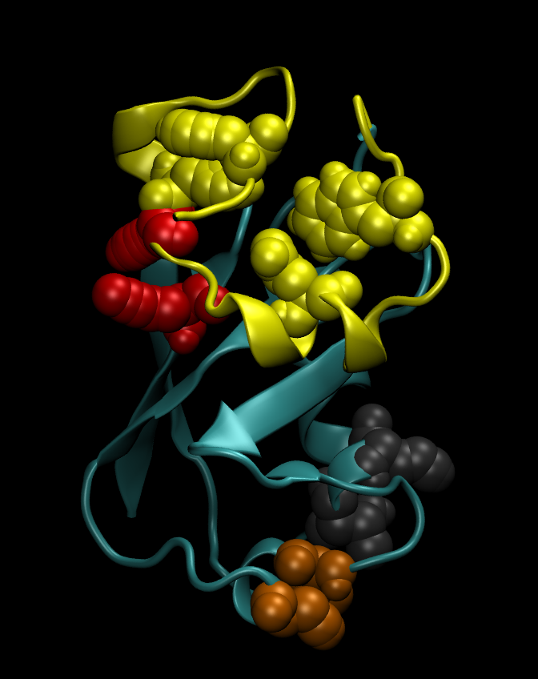

# PARENT_GPU
CUDA-enabled computation of biomolecular configurational entropy from molecular dynamics trajectories.
<br />
<br />
<br />
<p align="center">
  
  <br />
  <b>Interaction clusters in a Ubiquitin-UBM2 protein complex.</b> The clusters were identified<br /> using mutual information terms calculated with PARENT_GPU. The Ubiquitin<br /> backbone is shown in blue-grey, the UBM2 backbone in yellow. The two clusters,<br /> represented as spheres, at the bottom (brown and dark grey)  acknowledge the strong<br /> interaction in alpha-helices. The large yellow cluster demonstrates the concerted motion<br /> in the dynamical UBM2 ligand.  The red cluster characterizes the binding of UBM2<br /> to Ubiquitin. It consists of a protonated Lysine in Ubiquitin and a Tyrosine in UBM2.<br /> Note that for visualization purposes only, the average structure over the simulated<br /> Ubiquitin-UBM2 trajectory was used, so e. g. the red Tyrosine in UBM2 looks distorted.<br /> The underlying entropy calculations do not apply any structure averaging.
</p>

<br />
<br />

    Copyright (C) 2020  Markus Fleck

    This program is free software: you can redistribute it and/or modify
    it under the terms of the GNU General Public License version 3 as 
    published by the Free Software Foundation.

    This program is distributed in the hope that it will be useful,
    but WITHOUT ANY WARRANTY; without even the implied warranty of
    MERCHANTABILITY or FITNESS FOR A PARTICULAR PURPOSE.  See the
    GNU General Public License for more details.

    You should have received a copy of the GNU General Public License
    along with this program.  If not, see <https://www.gnu.org/licenses/>.
<br /> 
<br />


# General considerations
This code has its roots in my PARENT repository, which features hybrid MPI/openMP architecture and is targeted at CPU clusters. PARENT_GPU
was written to enable information-theoretical, expansion-based configurational entropy calculations on workstations. In particular this means that CPU
RAM is not a limiting factor anymore, since PARENT_GPU is efficient in reloading from the hard disk. By making use of GPUs, the code is performant. Roughly 
speaking, you can expect a single GPU to outperform a CPU cluster of ~150 cores (or more). The reason for this surprising performance is that the number of 
calculations performed on the GPU essentially grows with the square of the amount of data transferred, as 2D entropy terms are calculated for each possible pair of degrees of 
freedom. In more intuitive words, GPUs are such beasts in raw computation that providing them enough data to keep them busy calculating is a crucial task. Therefore, performing calculations for every possible pair in the data you provide is a scenario where they really shine. 

One of the strongest motivations for writing this code was the fact 
that the calculated mutual information terms essentially form a distance matrix of interaction strengths inside molecules (or between molecules). Using these 
terms for machine learning strongly suggests itself and a first program is included with this version of the code
(a result for the Ubiquitin-UBM2 complex is shown above).

# TODOs/Known Issues/Future plans
- Update this readme for the new programs analyze_residue.cpp, analyze_residue_pair.cpp and hierarchical_residue_clusters.cpp 
- This code was extensively tested on my own computers/molecules. Remember, however, that code matures with the feedback of its users.
- The Entropy_Matrix class should be wrapped into Python in order to make use of its abundant machine learning libraries.
- More than 95% percent of the calculation time is spent during binning histograms. Entropy calculations are quite special in this respect,
as ~2500 bins are the usual scenario here. This greatly reduces atomicAdd penalties and therefore, many standard optimization techniques have very limited effect. The one bottle-neck on consumer graphics cards is double precision performance. It might be possible to use fixed-point arithmetic for PARENT_GPU, circumventing
the low double precision performance of consumer-grade GPUs.
- Currently, PARENT_GPU uses multiple (heterogeneous) GPUs, if available, on a single workstation. I might provide a GPU cluster version at some point in the future.  


# 0) QUICK AND DIRTY <br />  
Install the requirements. The program needs at least CUDA 9.0. Additionally, libgromacs-dev 
needs to be installed to read the trajectories. E. g. on Debian/Ubuntu/Linux Mint issue

    sudo apt install libgromacs-dev

inside a shell. Then unzip and navigate to the top folder. In the file run.sh change the parameter
IN_NAME to the path and name of your .top and .xtc files ignoring the file extensions.
(if those two files have different base names, consider changing them or using symbolic links).
Change OUT_NAME to "output/{name_of_your_protein}". Review the commented configuration in the 
first lines of run.sh. Then run

    bash run.sh
    
inside your shell. The configurational entropy output using the maximum information spanning tree (MIST) approximation 
is contained in "output/{name_of_your_protein}_MIST.txt". The residue interaction networks are contained in output/{name_of_your_protein}.vmd (this file can be loaded in vmd for visualization).

If you run the code for testing purposes only without any modifications,
the calculation should take something like 2-5 minutes. The resulting values at the end of the
files should match those in "test_system/sample_output".

You are strongly encouraged to read the rest of this document, but at least the next section.
 


# 1) INSTALLATION AND TESTING
## 1.1) Basics

  PARENT_GPU uses NVIDIA CUDA, so you need to make
  sure that your system supports this. The minimum requirements are CUDA 9.0
  as well as a graphics card supporting CUDA compute capability 6.1.
  
  The code was developed and tested on a GTX 1060, GTX 1070 as well as a RTX 2060 Super,
  with CUDA 11.0 installed, Linux Mint 19.3 Tricia as the GNU/Linux operating system,
  libgromacs version 2018.1-1, g++ version 7.5.0. libgromacs versions >= 2019 are not supported, 
  see below for fixing compilation errors concerning "gromacs/fileio/xtcio.h". If you run into other issues, please
  consider sending me a bug report containing the according information as just given.

  Sample trajectory and topology files are shipped with this package.
  To check out if your system correctly compiles and runs all of the provided
  programs, in a bash shell type:
  
    make clean
    make
    make checks
    
  Your system executes the code correctly if the following lines are the last output of ```make checks```:
     
    PARENT_GPU: pass
    MIST_GPU: pass
    MIST_openMP: pass
    hierarchical_resdiue_clusters: pass
    analyze_residue: pass
    analyze_residue_pair: pass

      
  
  After executing the "run.sh" script, the compiled executables are located in the folder
  "bin". For compilation, the "Makefile" in the top directory is processed by "run.sh", so this is where you might 
  want to start troubleshooting (or maybe fine tuning). Note that the Makefile supports compiling for a CUDA capability higher than
  6.1 by issuing ```make CUDA_ARCH={cuda_capability_without_dot}```.

## 1.2) Troubleshooting
### 1.2.1) Fixing "fatal error: gromacs/fileio/xtcio.h: No such file or directory"
You need to have a libgromacs version <= 2018.8 installed. Newer versions do not include the functions declared in xtcio.h, which is used for reading the GROMACS trajectory .xtc files. Ubuntu 18.04 and Linux mint 19.3 feature the libgromacs-dev package version 2018.1-1, so

    sudo apt install libgromacs-dev

is sufficient here. Older versions should probably work as well. If your operating system is Ubuntu >=20/Linux Mint >=20 or another GNU/Linux distribution, applying the following steps analogously should do the trick:

    mkdir -p ~/programs/gromacs-2018.8_build/
    cd ~/programs/gromacs-2018.8_build/
    wget ftp://ftp.gromacs.org/pub/gromacs/gromacs-2018.8.tar.gz
    tar xvfz gromacs-2018.8.tar.gz
    mkdir -p gromacs-2018.8/build
    cd gromacs-2018.8/build

If you have a gcc version < 4.8.1 or >=9, install e. g. gcc-8 and use it for compilation.
On Ubuntu/Linux Mint/Debian and relatives issue:

    sudo apt install gcc-8
    export CC=`which gcc-8`

Continue with (you can try to speed up the compilation by using multiple cores: use e. g. make -j4 on a quad core machine):

    cmake .. -DGMX_BUILD_OWN_FFTW=ON -DREGRESSIONTEST_DOWNLOAD=ON -DCMAKE_INSTALL_PREFIX=~/programs/gromacs-2018.8
    make
    make check
    make install

If you have problems downloading the regression tests, go with -DREGRESSIONTEST_DOWNLOAD=OFF and skip "make check".

Last but not least, you need to set environment variables. On Ubuntu/Linux Mint/Debian and relatives, this is done by:

    export CPLUS_INCLUDE_PATH=~/programs/gromacs-2018.8/include:$CPLUS_INCLUDE_PATH
    export LIBRARY_PATH=~/programs/gromacs-2018.8/lib:$LIBRARY_PATH
    export LD_LIBRARY_PATH=~/programs/gromacs-2018.8/lib:$LD_LIBRARY_PATH

You might consider adding the above three lines to your ~/.bashrc file. Note, however, that setting these environment variables might interfere with another GROMACS installation you might have. In this case, comment the lines in your .bashrc and use a fresh shell before using GROMACS again.  
   
  
#  2) RUNNING YOUR OWN TRAJECTORIES
  
  The easiest way to do this is by just modifying the file "run.sh" in the top directory as described 
  chapter 0 as well as in run.sh by the comments:
  
  The input files (GROMACS .top and .xtc) as well as the output path/name should be specified either 
  relative to the top directory of the package or as an absolute path.
  
  The "OUT_NAME" parameter specifies the prefix of all output files. If you want to do multiple 
  calculations using the same output folder, you should change this parameter every time. Otherwise 
  your previous results will be overwritten without a warning.
  
  The NBINS parameter controls how many bins are used for building the histograms which sample the 
  probability densities of the degrees of freedom. For the 2D values (on which the mutual information terms are based), 
  the square of this value will be used for building the histograms. This means if you set NBINS=50, 2500 bins will be used for every 2D histogram.
  This parameter is used exclusively during the Mutual Information Expansion (MIE) calculations, performed 
  by the program PARENT\_GPU, which can be considered the core of this suite. Using 50 of them seems 
  to be a good starting point for ~10^6 frames of the MD trajectory. If you have considerably more
  (less) frames to process, you might want to tweak these parameters slightly up (down).
  If in doubt, just leave this parameter as it is.
  
  The "BACKBONE_ATOMS" parameter is designed to find rigid torsion angles in your topology, 
  e. g. at a protein backbone. The names of the atoms here should match the names from 
  the GROMACS .top file. Other dihedrals are declared relative to the backbone dihedrals if they 
  share 3 atoms with them (termed phaseangles). This improves the accuracy of the
  entropy calculations, as the relative phase angles explore a much smaller range of values.
  
  In the case you want to run a considerable amount of trajectories so that compilation/check time 
  is an issue for you, you might want to comment the lines
  
    make clean
    make CUDA_ARCH=${CUDA_ARCH}
    make checks
    
especially the line
    
    make checks
    
  in run.sh (after you compiled successfully for the first time), but keep in mind to recompile with
  	
    make clean; make CUDA_ARCH={cuda_capability_without_dot}
  
  when you change computers (e. g. heterogeneous cluster).
  
#  3) EXPLANATION OF THE PROGRAMS
  
  
##  3.1) BAT_builder
    
This program converts your GROMACS topology (.top) and trajectory (.xtc) files to binary .bat
trajectory files, which are then processed by PARENT_GPU, the core program of
this suite. The main purpose of this program is to convert every frame in the .xtc file,
which is stored in Cartesian coordinates, to internal bond-angle-torsion (BAT, Z-matrix) coordinates.
Furthermore additional information is attached to the header of the resulting .bat file, namely 

- a version number
- the precision of the file (single or double precision)
- the number of non-redundant torsion angles (dihedrals) in the system 
(which relates to the number of atoms by #atoms = #torsions + 3)
- the number of frames in the trajectory
- a list of all non-redundant torsion angles
(specifying their constituent atoms using the atom numbers from the .top file)
- atom weights of all atoms in the system
- atom names, residue names, residue numbers and molecule names for every atom in the system

The program is used in the following manner:

	bin/BAT_builder -t input.top -x input.xtc -o output.bat -bb "BackboneAtomName1 BackboneAtomName2 BackboneAtomName3 ..." [--single_precision]

input.top, input.xtc and output.bat are self-explanatory.

"BackboneAtomName1 BackboneAtomName2 BackboneAtomName3 ..." lists the names of atoms belonging to a rigid backbone
as stated in the .top file, e. g.  "CA C N H1 O1" for a protein. Phaseangles are defined relative to a rigid dihedral,
improving numerical accuracy. Also see section 2 for further information.

[single_precision] (the square brackets indicate optional), if set, writes the .bat trajectory in single precision instead of double precision,
which is discouraged, since all calculation is done in double precision anyway. Only use single precision if you are short of harddisk storage.

Additionally, the program can perform a back-conversion from .bat to .xtc, which is done by issuing the following command:

	./BAT_builder.x -b input.bat -o output.xtc


When the trajectory of a complex consisting of more than one molecule is converted, non-physical bonds (termed pseudo-bonds)
are added in order for the complex to have a connected topology. This is done automatically. Also the algorithm guarantees
that the chosen topology for every molecule in the complex is consistent with the topology which would be chosen if the molecules would be treated separately, in 
isolation.

## 3.2) convert_BAT_to_GBAT
This program was developed especially for the present GPU version of PARENT, i. e. PARENT_GPU. While the original version of PARENT is designed for CPU 
clusters,
PARENT_GPU is targeted at workstations. This means that PARENT_GPU will 
reload parts of the trajectory from the hard disk if the whole trajectory does not fit into CPU RAM, which is often the case. GROMACS trajectories are stored in a per-frame 
fashion: for 
every time step, the coordinates of the whole molecule are stored together, followed by the next frame. This means that the trajectory of a specific coordinate
is scattered across the .xtc file. The .bat file format follows this convention. However, this format is inefficient for expansion-based entropy calculation:
To compute 2D entropy values, the whole trajectory of both coordinates needs to be processed, i. e. loaded from hard disk if the CPU RAM is too small to hold the whole
trajectory. The .gbat format now stores the trajectory of coordinates in a contiguous fashion, significantly improving hard disk reading times. For large projects,
this speeds up the computations tremendously, given that every pair of coordinate trajectories needs to reside in CPU RAM once, requiring many hard disk fetches.
As a rule of thumb, consider using it for molecules larger than 2500 atoms
with at least a million frames (for small systems, the time this conversion takes does hardly pay off). It is used in the following manner: 

    bin/convert_BAT_to_GBAT -f input.bat -o ouput.gbat --ram #GiB
    
input.bat and output.bat are self-explanatory. #GiB is the amount of CPU RAM you can provide in GiB. Be a little conservative here: If you have 16 GB RAM 
installed, set 
10 GiB here. 


## 3.3) PARENT_GPU

This program can be considered the core of this suite. It calculates the configurational entropy according to the pairwise 
Mutual Information Expansion (MIE). A dedicated publication on this GPU version of PARENT is in preparation. Meanwhile, please read our article in the Journal of 
Chemical Theory and Computation  

"PARENT: A Parallel Software Suite for the Calculation of Configurational Entropy in Biomolecular Systems"  
DOI: 10.1021/acs.jctc.5b01217 

and additionally

B. J. Killian, J. Y. Kravitz, and M. K. Gilson, J. Chem. Phys. 127: 024107 (2007).  
J. Numata, and E.-W. Knapp, J. Chem. Theory Comput. 8: 1235 (2012).  

PARENT_GPU takes either a .bat or a .gbat file as an input. 

The program is used in the following manner:

	bin/PARENT_GPU -f input.[g]bat -o entropy.par -b #bins --cpu_ram #GiB --gpu_ram #GiB

input.[g]bat is the result from the conversion to internal BAT coordinates done with BAT_builder or (subsequently) convert_BAT_to_GBAT.

entropy.par is the binary output file, containing all the 1D and 2D entropy terms (from which the mutual information terms can be easily calculated).
The header of the file includes the same information as for the .bat file as well as the numbers of bins which were used for the entropy calculation. The cpu_ram and gpu_ram parameters are the respective RAM amounts you want to provide. Assuming your system is not performing any other
calculations (which I would discourage), be somewhat conservative with the cpu_ram and a little conservative with the gpu_ram. E. g., if your machine has 32 GB 
RAM and your GPU has 6 GB RAM, set 25 GiB for cpu_ram and 5.25 for gpu_ram. Being to aggressive here may result in either the Linux kernel or the NVIDIA driver 
killing your program, which might be a painful experience if you run a large system where the calculation takes a long time. From my experience by now, PARENT_GPU 
is surprisingly fast even with small CPU/GPU RAM provided.

## 3.4) MIST_GPU

Although based on a different mathematical framework than MIE, the Maximum Information Spanning Tree (MIST) approximation relies on the same 
terms to be computed as for MIE. Empirically it seems to demonstrate far superior convergence properties, so from a computational perspective
one is tempted to consider MIST a refinement of MIE. We highly recommend applying MIST_GPU to your output .par file of PARENT_GPU (if you are 
interested in total configurational entropy values, you should consider this mandatory). Its computation time is negligible compared to PARENT_GPU. 
In addition to our article in the Journal of Chemical Theory and Computation   

"PARENT: A Parallel Software Suite for the Calculation of Configurational Entropy in Biomolecular Systems"  
DOI: 10.1021/acs.jctc.5b01217 

please read

B. M. King, N. W. Silver, and B. Tidor. J. Phys. Chem. B 116: 2891 (2012).

The program is used in the following manner:

	bin/MIST_GPU -f input.par -o output.par

The only difference between input.par and output.par is that only the significant mutual information terms are non-zero in output.par.


## 3.5) get_values_from_PAR
In order to read all entropy/mutual information terms, you need to decode the binary .par files, whether they come from the MIE (bin/PARENT_GPU) or the MIST 
(bin/MIST_GPU) calculation. For this purpose, get_values_from_PAR is provided. It lists the 1D entropy values of all degrees of freedom as well as all 2D entropy values and 
mutual information values of all pairs of degrees of freedom. The program is used in the following manner:

bin/get_values_from_PAR -p input.par [--short]

Its output is generally large. If you are only interested in a summary, specify the --short parameter. If you plan to e. g. use these values for machine learning,
I highly recommend to have a look at the src/util/classes/Entropy_Matrix.cpp class (in fact, I plan to wrap this class into a Python3 library).

## 3.6) analyze_residue
TODO

## 3.7) analyze_residue_pair
TODO

## 3.8) hierarchical_residue_clusters
TODO

# 4) CONTACT INFORMATION

If you have any questions, feel free to contact me: 

markus.fleck@univie.ac.at
or
fleck.markus@gmx.at

